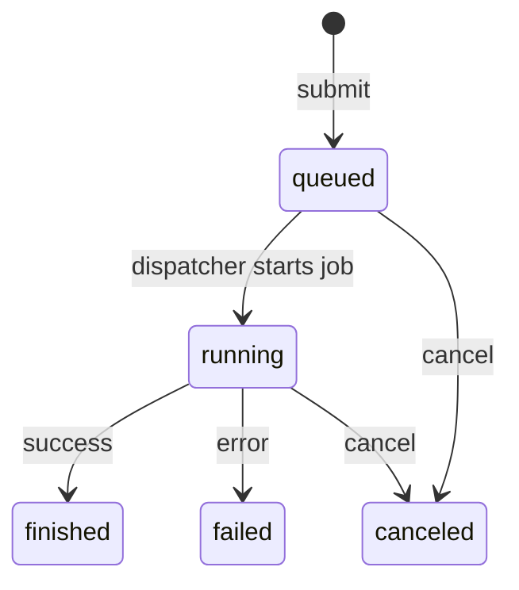

# Monitoring jobs

Once a job has been submitted to the queue with `gpuq`, it is possible to check its status and manage its execution using monitoring commands.

This section describes the available commands to:

- list jobs in the queue
- check their status
- cancel jobs if necessary

---

# Listing jobs

To see the jobs registered in the queue, use:

```bash
gpuq list
```

This command shows all jobs known to the queue, regardless of their state.

For each job, information such as the following is displayed:

- job identifier
- user who submitted it
- creation date
- description (if present)

This command **does not modify the system state**. It only queries the information stored in the queue.

---

# Job states

Each job in the queue is always in one of the following states:

| State | Description |
|---|---|
| `queued` | The job is registered in the queue and is waiting to be executed. |
| `running` | The job is currently running. |
| `finished` | The job finished successfully. |
| `failed` | The job finished with an error. |
| `canceled` | The job was canceled by the user. |

The state of a job is determined by the location of its file within the queue directory structure in the filesystem.

---

# Filtering jobs by state

It is possible to display only the jobs that are in a specific state using the `--state` option.

For example, to see only jobs waiting in the queue:

```bash
gpuq list --state queued
```

Other states can also be queried, for example:

```bash
gpuq list --state running
```

This is useful when there are many jobs registered in the system.

---

# Canceling a job

To cancel a job, use the command:

```bash
gpuq cancel JOB_ID
```

For example:

```bash
gpuq cancel job-1a2b3c4d
```

---

## Canceling jobs in the queued state

If the job is still in the `queued` state, the command will move it to the `canceled` state. This means the job **will not be executed**.

---

## Canceling jobs in the running state

If the job is already running (`running`), the command will mark the job as canceled.

The actual termination of the execution process will be handled by the system component responsible for running the jobs.

---

## Canceling finished jobs

Attempting to cancel a job that is already in the following states:

- `finished`
- `failed`
- `canceled`

will result in an error, since those jobs can no longer be modified.

---

# Job lifecycle

A job submitted to the queue typically follows the following lifecycle:



This cycle reflects the possible state transitions during the execution of an experiment.

---

# Summary

The main commands used to monitor jobs are:

| Command | Description |
|---|---|
| `gpuq list` | Show all jobs registered in the queue. |
| `gpuq list --state queued` | Show only jobs waiting in the queue. |
| `gpuq list --state running` | Show jobs currently running. |
| `gpuq cancel JOB_ID` | Cancel a job identified by its ID. |

In the next section we will see how to inspect **experiment logs** and access the results generated by jobs.