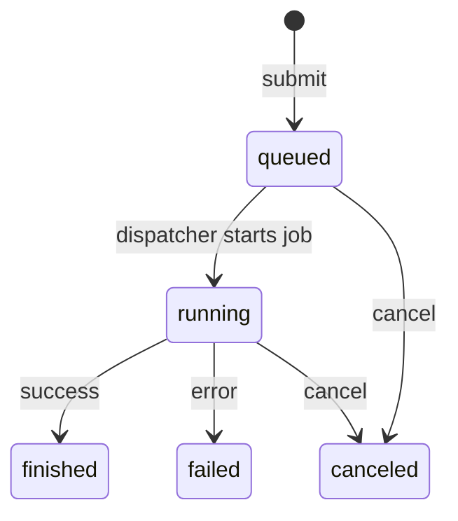

# Monitorizar trabajos

Una vez que un trabajo ha sido enviado a la cola con `gpuq`, es posible consultar su estado y gestionar su ejecución utilizando las órdenes de monitorización.

En esta sección se describen las órdenes disponibles para:

- listar trabajos en la cola
- consultar su estado
- cancelar trabajos si es necesario

---

# Listar trabajos

Para ver los trabajos registrados en la cola se utiliza:

```bash
gpuq list
```

Esta orden muestra todos los trabajos conocidos por la cola, independientemente de su estado.

Para cada trabajo se muestra información como:

- identificador del trabajo
- usuario que lo ha enviado
- fecha de creación
- descripción (si existe)

Esta orden **no modifica el estado del sistema**, únicamente consulta la información almacenada en la cola.

---

# Estados de los trabajos

Cada trabajo en la cola se encuentra siempre en uno de los siguientes estados:

| Estado | Descripción |
|---|---|
| `queued` | El trabajo está registrado en la cola y espera a ser ejecutado. |
| `running` | El trabajo está actualmente en ejecución. |
| `finished` | El trabajo ha finalizado correctamente. |
| `failed` | El trabajo ha terminado con un error. |
| `canceled` | El trabajo ha sido cancelado por el usuario. |

El estado de un trabajo se determina por la ubicación de su fichero dentro de la estructura de la cola en el sistema de ficheros.

---

# Filtrar trabajos por estado

Es posible mostrar únicamente los trabajos que se encuentren en un estado concreto utilizando la opción `--state`.

Por ejemplo, para ver únicamente los trabajos en espera:
```bash
gpuq list --state queued
```

También se pueden consultar otros estados, por ejemplo:
```bash
gpuq list --state running
```


Esto resulta útil cuando hay muchos trabajos registrados en el sistema.

---

# Cancelar un trabajo

Para cancelar un trabajo se utiliza la orden:
```bash
gpuq cancel JOB_ID
```

Por ejemplo:
```bash
gpuq cancel job-1a2b3c4d
```


---

## Cancelar trabajos en estado queued

Si el trabajo todavía está en estado `queued`, la orden lo moverá al estado `canceled`. Esto significa que el trabajo **no será ejecutado**.

---

## Cancelar trabajos en estado running

Si el trabajo ya está en ejecución (`running`), la orden marcará el trabajo como cancelado.

La finalización real del proceso de ejecución será gestionada por el componente del sistema encargado de ejecutar los trabajos.

---

## Cancelar trabajos finalizados

Intentar cancelar un trabajo que ya esté en estado:

- `finished`
- `failed`
- `canceled`

produce un error, ya que esos trabajos ya no pueden modificarse.

---

# Ciclo de vida de un trabajo

Un trabajo enviado a la cola suele seguir el siguiente ciclo de vida:



Este ciclo refleja las posibles transiciones de estado durante la ejecución de un experimento.

---

# Resumen

Las órdenes principales para monitorizar trabajos son los siguientes:

| Orden | Descripción |
|---|---|
| `gpuq list` | Muestra todos los trabajos registrados en la cola. |
| `gpuq list --state queued` | Muestra únicamente los trabajos que están en espera. |
| `gpuq list --state running` | Muestra los trabajos actualmente en ejecución. |
| `gpuq cancel JOB_ID` | Cancela un trabajo identificado por su ID. |

En la siguiente sección veremos cómo consultar **los logs de los experimentos** y cómo acceder a los resultados generados por los trabajos.